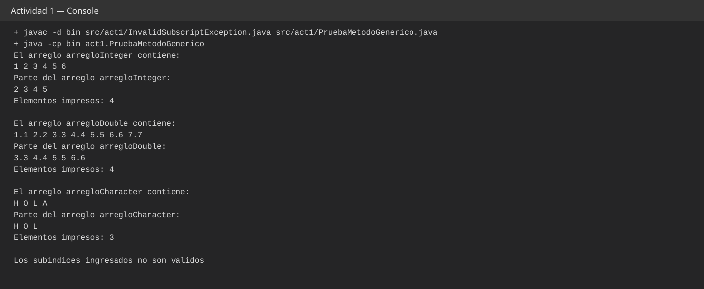
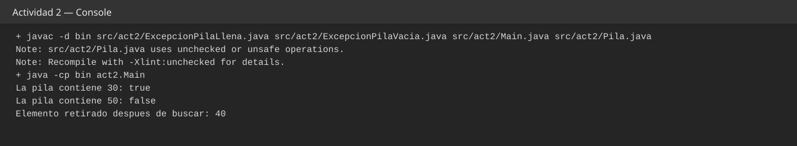
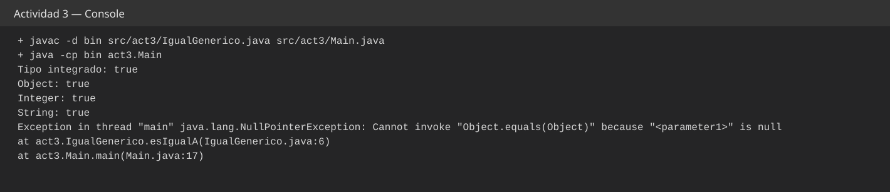
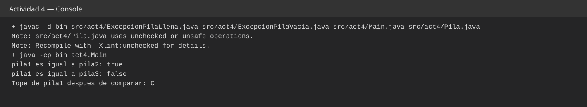
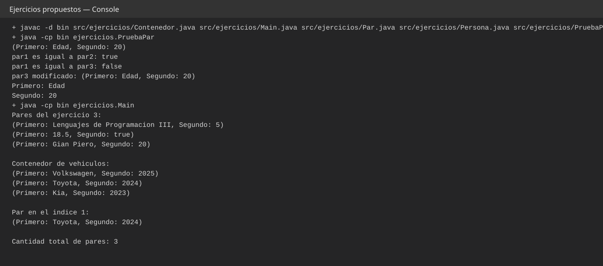

# UNIVERSIDAD CATÓLICA DE SANTA MARÍA
## ESCUELA PROFESIONAL DE INGENIERÍA DE SISTEMAS
### LENGUAJES DE PROGRAMACIÓN III
### PRÁCTICA N.° 05: GENERICS EN JAVA

| Código | Apellidos y Nombres | Fecha |
|---|---|---|
| 2025002762 | Rodríguez Fádel, Gian Piero Khalil | 28/09/2026 |

> Esta versión Markdown contiene el contenido académico del informe. La entrega en formato simple UCSM se encuentra también en DOCX y PDF en la entrega final del chat.

# 1. ACTIVIDADES

## 1.1 Actividad 1: método genérico `imprimirArreglo`

Se implementaron las dos versiones solicitadas: una que imprime todo el arreglo y otra sobrecargada que recibe `subindiceInferior` y `subindiceSuperior`, valida el rango, imprime únicamente los elementos comprendidos entre ambos índices y devuelve la cantidad impresa.

### Archivo `src/act1/InvalidSubscriptException.java`

Se creó una excepción propia porque la actividad exige lanzar `InvalidSubscriptException` cuando los subíndices no cumplen las condiciones. Hereda de `RuntimeException` para poder lanzarse directamente desde el método sin obligar al código que lo invoca a declarar `throws`. Su constructor recibe el mensaje y lo pasa a la superclase, manteniendo la clase pequeña y con una sola responsabilidad.

### Archivo `src/act1/PruebaMetodoGenerico.java`

La primera versión de `imprimirArreglo` usa el parámetro de tipo `E` y un recorrido for-each; por ello funciona con `Integer`, `Double`, `Character` o cualquier otro tipo de referencia sin duplicar métodos. La segunda versión agrega los dos índices. Primero comprueba que el inferior no sea negativo, que el superior esté dentro del arreglo y que sea estrictamente mayor que el inferior. Si alguna condición no se cumple, lanza la excepción pedida. Si el rango es válido, recorre desde el límite inferior hasta el superior, ambos incluidos, aumenta un contador y devuelve ese contador.

El `main` prueba ambas versiones con tres arreglos y también fuerza un caso inválido con índices iguales para verificar el manejo de la excepción.

## 1.2 Actividad 2: pila genérica y `contains`

### Archivo `src/act2/ExcepcionPilaLlena.java`

Representa el intento de insertar un elemento cuando `superior` ya apunta a la última posición disponible. El mensaje se genera en `push` y la excepción únicamente lo transporta.

### Archivo `src/act2/ExcepcionPilaVacia.java`

Representa un `pop` cuando `superior == -1`. Al separar este caso en una excepción propia, `Pila` mantiene claro el control de errores de la estructura.

### Archivo `src/act2/Pila.java`

La clase `Pila<E>` conserva el estilo del código proporcionado. `tamanio` define la capacidad, `superior` la posición del tope y `elementos` el arreglo que almacena los datos. El constructor por defecto delega en el constructor de tamaño con capacidad 10. Como Java no permite crear directamente `new E[]`, el arreglo se crea como `Object[]` y se convierte a `E[]`.

El constructor de copia replica `tamanio`, `superior` y los elementos mediante `System.arraycopy`, pero crea un arreglo nuevo. Por eso una operación destructiva sobre la copia no toca la pila original. `push` verifica si la pila está llena y luego incrementa el tope; `pop` verifica si está vacía y devuelve el elemento del tope reduciendo el índice.

`contains(E elemento)` crea una copia y realiza `pop` sobre ella desde el tope hacia el fondo, tal como pide la guía. Si `equals` encuentra coincidencia devuelve `true`; si la copia se agota, devuelve `false`. La pila original nunca cambia.

### Archivo `src/act2/Main.java`

Crea una `Pila<Integer>`, inserta cuatro elementos y consulta un valor presente y uno ausente. Finalmente ejecuta `pop` sobre la pila original; obtener 40 demuestra que `contains` no modificó su estado.

## 1.3 Actividad 3: `IgualGenerico`

### Archivo `src/act3/IgualGenerico.java`

El método estático `<E> boolean esIgualA(E a, E b)` usa directamente `a.equals(b)`, de acuerdo con el enunciado. Si `equals` es falso devuelve `false`; en caso contrario devuelve `true`. No se agregaron validaciones adicionales para conservar el comportamiento que la actividad busca observar con `null`.

### Archivo `src/act3/Main.java`

Prueba el método con un valor autoboxeado, `Object`, `Integer`, `String` y finalmente `null`. Las primeras llamadas devuelven `true`. La llamada `esIgualA(null, null)` compila porque la inferencia genérica admite una referencia nula, pero en ejecución se intenta invocar `equals` sobre `a`, que vale `null`, y se produce `NullPointerException`. Ese es precisamente el resultado que permite responder la pregunta planteada en la actividad.

## 1.4 Actividad 4: comparación de pilas

### Archivo `src/act4/ExcepcionPilaLlena.java`

Cumple la misma función que en la Actividad 2, pero pertenece al paquete `act4` para mantener cada actividad independiente y ejecutable por separado.

### Archivo `src/act4/ExcepcionPilaVacia.java`

Mantiene el control de la extracción sobre una pila vacía dentro del paquete de esta actividad.

### Archivo `src/act4/Pila.java`

La estructura conserva los constructores, `push`, `pop`, el constructor de copia y `contains`. Se agregó `esIgual(Pila<E> otraPila)`. Primero compara el valor de `superior`; si es distinto, las pilas no tienen la misma cantidad de elementos y devuelve `false`. Después crea una copia de cada pila y extrae elementos en paralelo. Como ambas copias se recorren desde el tope, los elementos se comparan exactamente en el mismo orden. Ante la primera diferencia devuelve `false`; si todas las comparaciones coinciden devuelve `true`. Ningún `pop` se aplica sobre las pilas originales.

### Archivo `src/act4/Main.java`

Construye tres pilas: dos con el mismo contenido y orden, y una con los mismos valores en orden diferente. La primera comparación devuelve `true` y la segunda `false`. Después se hace `pop` en `pila1` y se obtiene `C`, comprobando que el método de comparación tampoco modifica la pila original.

# 2. EJERCICIOS

## 2.1 y 2.2 Clase genérica `Par<F,S>` y comparación

### Archivo `src/ejercicios/Par.java`

La clase declara dos parámetros de tipo independientes, `F` y `S`, para permitir que el primer y el segundo componente tengan tipos distintos. Los atributos `primero` y `segundo` se inicializan en el constructor. Los métodos `getPrimero`, `getSegundo`, `setPrimero` y `setSegundo` proporcionan el acceso y modificación pedidos.

`esIgual` recibe otro `Par<F,S>` y compara primero el primer componente y luego el segundo con `equals`. Solo devuelve `true` si ambos valores coinciden en la misma posición. `toString` produce exactamente una representación de la forma `(Primero: x, Segundo: y)`.

### Archivo `src/ejercicios/PruebaPar.java`

Crea tres pares de `String` e `Integer`. Dos son iguales y uno difiere en el primer elemento. Se imprimen ambas comparaciones y luego se modifica el tercer par con `setPrimero`; finalmente se prueban los dos getters. Así se ejercitan todos los métodos solicitados de `Par`.

## 2.3 Método genérico estático `imprimirPar`

### Archivo `src/ejercicios/Persona.java`

Es una clase mínima usada como tipo de dominio para una de las combinaciones exigidas. Guarda `nombre` y redefine `toString` para que al imprimir un `Par<Persona,Integer>` aparezca un valor legible.

### Archivo `src/ejercicios/Main.java`

Declara `public static <F,S> void imprimirPar(Par<F,S> par)`, por lo que el mismo método imprime pares con cualquier combinación de tipos. El `main` construye exactamente las tres combinaciones pedidas: `String,Integer`, `Double,Boolean` y `Persona,Integer`.

El mismo archivo también demuestra el Ejercicio 4. Se crea un `Contenedor<String,Integer>` con la temática de vehículos, usando la marca como primer elemento y el año como segundo. Se agregan varios registros, se muestran todos, se obtiene el elemento de un índice y se consulta la lista completa.

## 2.4 Clase genérica `Contenedor<F,S>`

### Archivo `src/ejercicios/Contenedor.java`

La clase mantiene un `ArrayList<Par<F,S>>`, de modo que puede almacenar una cantidad dinámica de pares y conservar la seguridad de tipos. El constructor inicializa la lista. `agregarPar` recibe los dos valores y crea el `Par` antes de agregarlo. `obtenerPar` devuelve el par ubicado en el índice indicado. `obtenerTodosLosPares` devuelve el `ArrayList` completo con su parametrización genérica. `mostrarPares` recorre la colección con un for-each e imprime cada elemento mediante su `toString`.

La temática se encuentra en los datos del programa principal y no en la clase, por lo que `Contenedor` sigue siendo reutilizable con cualquier par de tipos.

# 3. CUESTIONARIO

## 1. ¿Qué significa restringir un tipo genérico con `extends`?

Restringir un parámetro con `extends` establece un límite superior: el argumento de tipo debe ser la clase indicada o un subtipo. Esto permite al compilador asumir las operaciones disponibles en ese límite y rechazar tipos incompatibles. Por ejemplo, `<T extends Number> double doble(T valor)` puede aceptar `Integer` o `Double` y usar `doubleValue()`. En Generic Java, las variables de tipo se traducen usando sus límites durante el borrado, por lo que esos límites forman parte del mecanismo de seguridad estática (Bracha et al., 1998; Igarashi et al., 2001).

## 2. Limitaciones de los generics y tipos primitivos

Los parámetros genéricos representan tipos de referencia; por eso no es válido `List<int>` ni `Pila<double>`. Se usan envolventes como `Integer` y `Double`, con autoboxing cuando corresponde. Otra limitación procede del *type erasure*: gran parte de la información de los argumentos de tipo se elimina al compilar, lo que impide operaciones como `new T()`, `new T[]` y ciertas comprobaciones directas de tipos parametrizados en tiempo de ejecución. La literatura también documenta que el borrado introduce restricciones y mensajes de compilación que pueden ser poco intuitivos (Gerakios et al., 2014; Bracha et al., 1998).

## 3. Caso de uso real de generics

Una capa de acceso a datos puede definir `Repositorio<T>` con operaciones como `guardar(T objeto)` y `T buscarPorId(...)`. Luego pueden existir repositorios de clientes, vehículos o ventas sin duplicar la estructura básica y sin perder seguridad de tipos. El compilador evita que, por ejemplo, un repositorio de vehículos reciba por error un objeto de cliente. Esto reduce conversiones explícitas, hace visible la intención de la API y desplaza muchos errores de ejecución hacia la compilación (Bracha et al., 1998; Igarashi et al., 2001).

## 4. Generics y jerarquías de clases

La herencia del argumento de tipo no se traslada automáticamente al tipo parametrizado. Aunque `Integer` es subtipo de `Number`, `List<Integer>` no es subtipo de `List<Number>`. Esta invariancia evita inserciones inseguras. Para expresar relaciones más flexibles se usan wildcards, por ejemplo `? extends Number` para aceptar distintos subtipos en contextos principalmente de lectura y `? super Integer` para ciertos contextos de escritura. La interacción entre subtipado, parametrización y varianza es un aspecto central del diseño de los genéricos (Igarashi & Viroli, 2006; Torgersen et al., 2004).

## 5. ¿Qué es un wildcard?

Un wildcard es un argumento de tipo representado por `?` que expresa un tipo desconocido. `List<?>` acepta una lista cuyo argumento exacto no se conoce; `List<? extends Number>` representa algún subtipo desconocido de `Number`; y `List<? super Integer>` representa algún supertipo desconocido de `Integer`. Los wildcards introducen varianza en el punto de uso y permiten tratar de forma segura distintas instancias de una misma clase parametrizada (Torgersen et al., 2004).

## 6. Diferencia entre un parámetro `T` y un wildcard `?`

`T` da nombre a un tipo y permite relacionarlo en varias partes de la declaración. Por ejemplo, `<T> T primero(List<T> lista)` expresa que el retorno tiene exactamente el mismo tipo que los elementos de la lista. `?`, en cambio, expresa un tipo desconocido cuando no se necesita nombrarlo: `void mostrar(List<?> lista)` puede recibir listas de argumentos distintos cuando el método solo necesita tratar sus elementos como `Object`. Si hay que vincular parámetros o el retorno con el mismo tipo, conviene `T`; si solo se necesita aceptar una familia de tipos sin nombrar el argumento exacto, suele bastar un wildcard (Torgersen et al., 2004).

## 7. ¿Qué significa `<T extends Comparable<T>>`?

Es un límite recursivo o *F-bounded*: `T` debe implementar `Comparable` parametrizado con el mismo `T`. Así el compilador sabe que un objeto `T` puede compararse con otro `T` mediante `compareTo`. Se utiliza en algoritmos de ordenación, máximos, mínimos y otras operaciones que dependen del orden natural. Por ejemplo, `<T extends Comparable<T>> T maximo(T a, T b)` puede invocar `a.compareTo(b)` sin conocer de antemano el tipo concreto (Igarashi et al., 2001; Bracha et al., 1998).

# 4. BIBLIOGRAFÍA

Bracha, G., Odersky, M., Stoutamire, D., & Wadler, P. (1998). *Making the future safe for the past: Adding genericity to the Java programming language*. Proceedings of the ACM SIGPLAN Conference on Object-Oriented Programming, Systems, Languages, and Applications, 183–200. doi: 10.1145/286936.286957

Igarashi, A., Pierce, B. C., & Wadler, P. (2001). *Featherweight Java: A minimal core calculus for Java and GJ*. ACM Transactions on Programming Languages and Systems, 23, 396–450. doi: 10.1145/503502.503505

Igarashi, A., & Viroli, M. (2006). *Variant parametric types: A flexible subtyping scheme for generics*. ACM Transactions on Programming Languages and Systems, 28, 795–847. doi: 10.1145/1152649.1152650

Gerakios, P., Biboudis, A., & Smaragdakis, Y. (2014). *Reified type parameters using Java annotations*. ACM SIGPLAN Notices, 49(3), 61–64. doi: 10.1145/2637365.2517223

Torgersen, M., Hansen, C. P., Ernst, E., Bracha, G., & Gafter, N. (2004). *Adding wildcards to the Java programming language*. Journal of Object Technology, 3, 97–116. doi: 10.5381/jot.2004.3.11.a5
